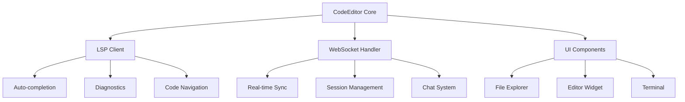

# 🚀 CodeEditor: The Future of Collaborative Development

<div align="center">


[](https://www.gnu.org/licenses/gpl-3.0)
[](https://www.qt.io)
[](https://isocpp.org/std/the-standard)
[](https://github.com/ToMaTiKkk/CodeEditor)
[](http://makeapullrequest.com)

**Не просто IDE. Не просто редактор. Это революция в командной разработке.**

*Представляем новую эру совместного кодинга, где расстояние между разработчиками исчезает, а продуктивность достигает невиданных высот.*

[🎯 Быстрый Старт](#-быстрый-старт) • [📖 Документация](#-документация) • [🌟 Возможности](#-что-делает-codeeditor-особенным) • [🛠️ Установка](#️-установка-и-сборка) • [💡 Для Разработчиков](#-для-разработчиков)

---

</div>

## 🌟 Что делает CodeEditor особенным?

> *"Когда команда работает как единое целое, магия случается сама собой"*

### 🔥 **Революционная Совместная Работа**
- **Синхронизация в реальном времени**: Видите курсоры коллег, их выделения и изменения мгновенно
- **Защищенные сессии**: Создавайте приватные сессии с парольной защитой
- **Умное управление правами**: Администратор может временно отключать редактирование участников
- **Встроенный командный чат**: Обсуждайте код, не покидая IDE

### 🧠 **Интеллектуальная Поддержка Кода (LSP)**
- **Мгновенное автодополнение**: Умные подсказки для C++, Python и других языков
- **Продвинутая диагностика**: Ошибки и предупреждения в реальном времени  
- **Навигация по коду**: Переход к определению, поиск ссылок *(в разработке)*
- **Контекстные подсказки**: Документация прямо в редакторе

### ⚡ **Максимальная Производительность**
- **Встроенный терминал**: Полный доступ к командной строке системы
- **Быстрая компиляция**: Кнопка "Запустить код" для мгновенного тестирования
- **Интеллектуальный файловый менеджер**: Древовидная навигация по проекту
- **Адаптивные темы**: Элегантная темная и классическая светлая тема

### 🌍 **Кроссплатформенность**
- **Linux, macOS**: Полная поддержка со всеми возможностями
- **Windows**: В разработке (встроенный терминал портируется)
- **Современная архитектура**: Построено на Qt 6 и C++17
- **Расширяемость**: Гибкая настройка LSP-серверов

---

## 📸 Галерея

<div align="center">

### Главный интерфейс
*Элегантный и функциональный дизайн, созданный для продуктивности*


### Совместная работа в действии
*Несколько разработчиков, один код, бесконечные возможности*


### LSP интеграция
*Интеллектуальные подсказки и диагностика кода*


### Встроенный терминал
*Вся мощь командной строки под рукой*


</div>

---

## 🎯 Быстрый Старт

### Системные Требования

<details>
<summary><b>🖥️ Минимальные требования (нажмите для раскрытия)</b></summary>

**Обязательные компоненты:**
- **Qt 6 Framework**: Версия 6.2+ с модулями Core, Gui, Widgets, Network, Websockets, Concurrent
> **Примечани:** Совместимо и с Qt5, но воизбежание багов рекомендуется Qt6
- **C++ Compiler**: Поддержка C++17 (GCC 7+, Clang 5+, MSVC 2017+)
- **CMake**: Версия 3.16+

**Рекомендуемые LSP серверы:**
- **C/C++**: [clangd](https://clangd.llvm.org/) для максимального интеллекта
- **Python**: [pyright](https://github.com/microsoft/pyright) или [pylsp](https://github.com/python-lsp/python-lsp-server)
- **JavaScript/TypeScript**: [typescript-language-server](https://github.com/typescript-language-server/typescript-language-server)

</details>

### 🚀 Молниеносная Установка

```bash
# 1. Клонируем репозиторий
git clone https://github.com/ToMaTiKkk/CodeEditor.git
cd CodeEditor

# 2. Создаем директорию сборки
mkdir build && cd build

# 3. Конфигурируем проект
cmake .. -DCMAKE_PREFIX_PATH=/path/to/Qt6

# 4. Собираем (используем все ядра для скорости)
make -j$(nproc)  # Linux/macOS
# или
cmake --build . --config Release  # Windows

# 5. Запускаем и наслаждаемся!
./CodeEditor
```

<details>
<summary><b>📋 Подробные инструкции для каждой платформы</b></summary>

#### Linux (Ubuntu/Debian)
```bash
# Установка зависимостей
sudo apt update
sudo apt install qt6-base-dev qt6-websockets-dev cmake build-essential qtermwidget 

# Сборка проекта
git clone https://github.com/ToMaTiKkk/CodeEditor.git
cd CodeEditor
mkdir build && cd build
cmake .. -DCMAKE_PREFIX_PATH=/usr/lib/x86_64-linux-gnu/qt6
make -j$(nproc)
```

#### Windows (MSVC) ⚠️
```cmd
# ⚠️ ВНИМАНИЕ: Windows поддержка в разработке
# Встроенный терминал пока не работает на Windows
# Мы активно работаем над портированием

git clone https://github.com/ToMaTiKkk/CodeEditor.git
cd CodeEditor
mkdir build && cd build
cmake .. -DCMAKE_PREFIX_PATH=C:/Qt/6.5.3/msvc2019_64
cmake --build . --config Release

# Примечание: Базовый функционал работает, но терминал временно недоступен
```

#### macOS
```bash
# Установка через Homebrew
brew install qt6 cmake qtermwidget

# Сборка проекта
git clone https://github.com/ToMaTiKkk/CodeEditor.git
cd CodeEditor
mkdir build && cd build
cmake .. -DCMAKE_PREFIX_PATH=$(brew --prefix qt6)
make -j$(sysctl -n hw.ncpu)
```

</details>

---

## 🛠️ Основные Возможности

### 👥 **Совместная работа нового поколения**

<table>
<tr>
<td width="50%">

**🎮 Создание сессии**
- Защита паролем
- Управление участниками
- Администраторские права
- Приватные комнаты

</td>
<td width="50%">

**🤝 Присоединение к команде**
- Мгновенная синхронизация
- Цветовая индикация участников
- Отслеживание курсоров
- Групповое редактирование

</td>
</tr>
</table>

### 🧠 **LSP Integration - Умный код**

```cpp
// CodeEditor понимает ваш код лучше, чем вы сами
class SmartEditor {
    void autocomplete() {
        // Мгновенные подсказки ↓
        std::vector<std::string> suggestions = getLSPSuggestions();
        // Диагностика в реальном времени ↓
        auto diagnostics = runCodeAnalysis();
        // Переход к определению - в разработке ↓
        // jumpToDefinition(cursor_position); // TODO: Скоро!
    }
};
```

### ⚡ **Встроенный терминал**

> ⚠️ **Примечание**: Терминал полностью поддерживается на Linux и macOS. Портирование на Windows в активной разработке.

```bash
# Компилируйте и запускайте прямо в IDE (Linux/macOS)
$ g++ -std=c++17 main.cpp -o app
$ ./app
Hello, CodeEditor World! 🚀

# Поддержка для множества языков
$ python script.py
$ go run main.go  
$ javac Main.java && java Main
```

---

## 🎨 Интерфейс и Персонализация

<div align="center">

| Светлая тема | Темная тема |
|--------------|-------------|
|  |  |
| *Классическая элегантность* | *Современный стиль* |

</div>

**Возможности персонализации:**
- 🎭 Мгновенное переключение тем
- 🏷️ Настраиваемые никнеймы
- 📝 Встроенный список дел (To-Do List)
- ⚙️ Гибкие настройки LSP

---

## 💡 Для Разработчиков

<div align="center">

### 🏗️ **Архитектурное Совершенство**

</div>

CodeEditor — это не просто проект, это **демонстрация инженерного мастерства**:

<table>
<tr>
<td width="33%">

**🔧 Современный C++17**
- RAII принципы
- Smart pointers  
- Lambda expressions
- STL containers
- Move semantics

</td>
<td width="33%">

**🌐 Qt 6 Mastery**
- Signal-slot система
- Model-View архитектура
- Custom widgets
- Concurrent programming
- Network programming

</td>
<td width="33%">

**🔗 WebSocket Protocol**
- JSON-based communication
- Real-time synchronization
- Custom protocol design
- Error handling
- Session management

</td>
</tr>
</table>

#### 🎯 **Ключевые технические достижения:**



---

## 🌟 Roadmap - Будущее CodeEditor

<div align="center">

### 🎯 **Ближайшие планы**

</div>

- [ ] **🔌 Plugin System** - Архитектура расширений
- [ ] **🔄 Git Integration** - Встроенный контроль версий  
- [ ] **🐛 Advanced Debugging** - Визуальный отладчик
- [ ] **🪟 Windows Full Support** - Завершение портирования терминала на Windows
- [ ] **🧭 Code Navigation** - Переход к определению и поиск ссылок (LSP)
- [ ] **📊 Code Analytics** - Метрики и статистика
- [ ] **🤖 AI Code Assistant** - ИИ помощник разработчика
- [ ] **☁️ Cloud Sync** - Синхронизация в облаке
- [ ] **🎮 Gamification** - Геймификация процесса разработки

---

## 📚 Документация

<div align="center">

| Документ | Описание | Аудитория |
|----------|----------|-----------|
| 📖 [**Руководство пользователя**](./doc_for_user.md) | Полное руководство по использованию | Пользователи |
| 🔧 [**Документация разработчика**](./doc.md) | Техническая документация и API | Разработчики |
| ⚖️ [**Лицензия**](LICENSE) | GNU GPLv3 - Свобода для всех | Все |
| 🐛 [**Issue Tracker**](https://github.com/ToMaTiKkk/CodeEditor/issues) | Сообщения об ошибках и предложения | Все |

</div>

---

## 🤝 Contributing

<div align="center">

**Станьте частью революции в разработке!**

[](https://github.com/ToMaTiKkk/CodeEditor/graphs/contributors)
[](https://github.com/ToMaTiKkk/CodeEditor/network/members)
[](https://github.com/ToMaTiKkk/CodeEditor/stargazers)

</div>

### 🎯 **Как внести вклад:**

1. **🍴 Fork** репозиторий
2. **🌿 Создайте** feature branch (`git checkout -b feature/AmazingFeature`)
3. **💾 Commit** изменения (`git commit -m 'Add some AmazingFeature'`)
4. **📤 Push** в branch (`git push origin feature/AmazingFeature`)
5. **🔄 Откройте** Pull Request

**Мы приветствуем вклады в виде:**
- 🐛 Исправления багов
- ✨ Новые возможности
- 📝 Улучшения документации
- 🧪 Тесты
- 🎨 UI/UX улучшения

---

## 📜 Лицензия

<div align="center">

**CodeEditor распространяется под лицензией GNU GPLv3**

*Мы верим в силу открытого программного обеспечения*

[](https://www.gnu.org/licenses/gpl-3.0)

**Это означает свободу:**
- ✅ Использовать в любых целях
- ✅ Изучать и модифицировать
- ✅ Распространять копии
- ✅ Улучшать и делиться улучшениями

*Единственное условие — сохранить эту свободу для всех*

</div>

---

## 🙏 Благодарности

<div align="center">

**CodeEditor стал возможен благодаря:**

- 🛠️ **Qt Project** - За мощный кроссплатформенный фреймворк
- 🧠 **LSP Community** - За стандартизацию языковых серверов  
- 🌐 **Open Source Community** - За бесконечную поддержку и вдохновение
- 💡 **All Contributors** - За каждый коммит, issue и звездочку

**Особая благодарность всем, кто делает разработку лучше!**

</div>

---

<div align="center">

### 🚀 **Начните свое путешествие с CodeEditor сегодня!**

**Превратите командную разработку из хаоса в симфонию**

[](https://github.com/ToMaTiKkk/CodeEditor/releases)
[](https://github.com/ToMaTiKkk/CodeEditor)

---

*Сделано с ❤️ и бесконечными чашками кофе ☕*

**CodeEditor © 2025 - Будущее разработки уже здесь**

</div>
